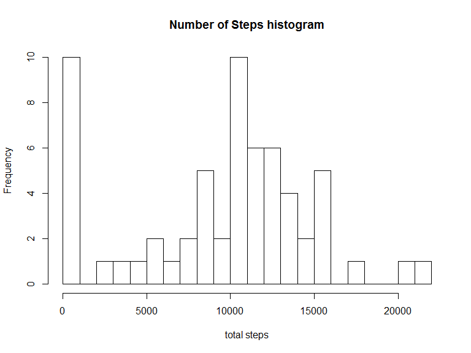
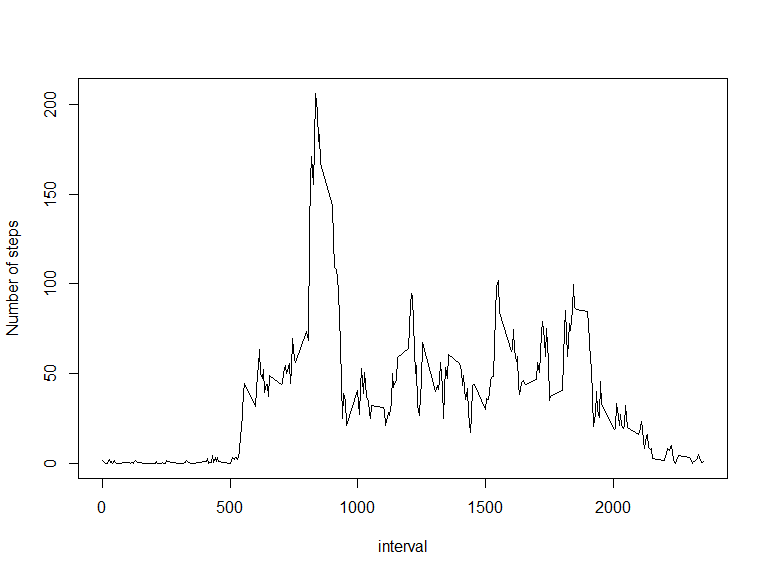
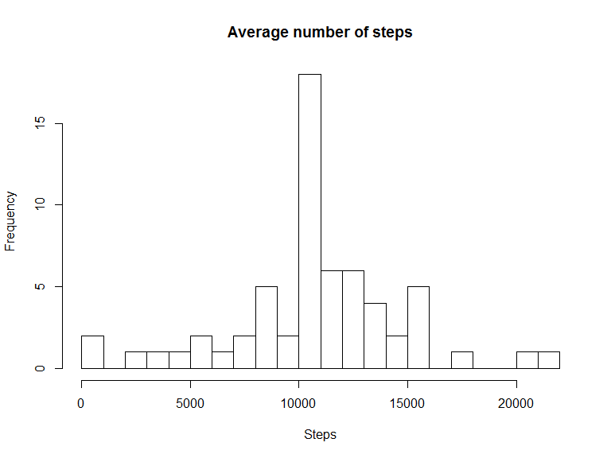
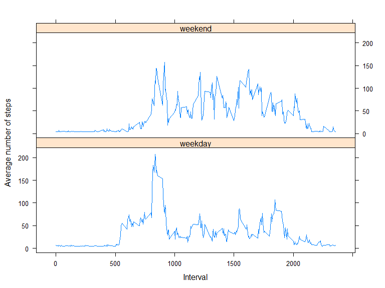

# Reproducible Research: Peer Assessment 1


## Loading and preprocessing the data
The following code will download the data and read to the R.

```r
require("dplyr")
if (file.exists("wearable.zip"))
{
  url="https://d396qusza40orc.cloudfront.net/repdata%2Fdata%2Factivity.zip"
  download.file(url, "wearable.zip", method="libcurl")
  unzip("wearable.zip")
}
data <- read.csv("activity.csv", header=TRUE, sep=",")
 
#Preprocess data to convert step and interval
data <- mutate(data, step=as.numeric(data$steps))
data <- mutate(data, step=as.numeric(data$interval))
head(data, 10)
```

```
##    steps       date interval step
## 1     NA 2012-10-01        0    0
## 2     NA 2012-10-01        5    5
## 3     NA 2012-10-01       10   10
## 4     NA 2012-10-01       15   15
## 5     NA 2012-10-01       20   20
## 6     NA 2012-10-01       25   25
## 7     NA 2012-10-01       30   30
## 8     NA 2012-10-01       35   35
## 9     NA 2012-10-01       40   40
## 10    NA 2012-10-01       45   45
```

## What is mean total number of steps taken per day?

```r
s <- data %>%
  group_by(date) %>%
  summarise_at(vars(steps), sum, na.rm=TRUE)
```
### Make a histogram of the total number of steps taken each day

```r
hist(s$steps, breaks=20, freq=TRUE, xlab="total steps", main="Number of Steps histogram")
```

<!-- -->

### Calculate and report the mean and median total number of steps taken per day
Mean number of step is 9354.23.

```r
m <-mean(s$steps) # this returns 9354.23
m
```

```
## [1] 9354.23
```
Median number of step is 10395.

```r
medianSteps <-median(s$steps) # returns 10395
medianSteps
```

```
## [1] 10395
```
## What is the average daily activity pattern?

```r
fs <- data %>%
  group_by(interval) %>%
  summarise_at(vars(steps), mean, na.rm=TRUE)
```

### Make a time series plot of the interval (x-axis) and the average number of steps taken 


```r
plot(fs$steps~fs$interval, xlab="interval", ylab="Number of steps", type="l")
```

<!-- -->

### Which 5-minute interval contains the maximum  umber of steps?

It appears that interval 835 has maximum number of steps. Which is roughly 1 PM.


```r
fs %>% filter(steps == max(steps))
```

```
## # A tibble: 1 x 2
##   interval    steps
##      <int>    <dbl>
## 1      835 206.1698
```

## Imputing missing values
Calculate and report the total number of missing values in the dataset (i.e. the total 
number of rows with NAs)


```r
sum(is.na(data$steps))
```

```
## [1] 2304
```
### Strategy of missing value
Devise a strategy for filling in all of the missing values in the dataset.
Assign the mean variable to those steps that's marked as NA, This way data won't get too biased after input the missing value.


```r
fdata <- data
meanSteps <- mean(data$steps, na.rm=TRUE)
fdata$steps[is.na(data$steps)] <- meanSteps
fs <- fdata %>%
  group_by(date) %>%
  summarise(totalSteps=sum(steps))
head(fs, 10)
```

```
## # A tibble: 10 x 2
##          date totalSteps
##        <fctr>      <dbl>
##  1 2012-10-01   10766.19
##  2 2012-10-02     126.00
##  3 2012-10-03   11352.00
##  4 2012-10-04   12116.00
##  5 2012-10-05   13294.00
##  6 2012-10-06   15420.00
##  7 2012-10-07   11015.00
##  8 2012-10-08   10766.19
##  9 2012-10-09   12811.00
## 10 2012-10-10    9900.00
```
## Show the histogram of total steps
Below is the histogram of totoal steps across all days.


```r
hist(fs$totalSteps, breaks=20, freq=TRUE, xlab="Steps", main="Average number of steps")
```

<!-- -->

Do these values differ from the estimates from the first part of the assignment? What is the impact of imputing missing data on the estimates of the total daily number of steps?

It seems inputing missing data cause the mean total number of steps increased to be more close to the median of steps.


```r
fm <-mean(fs$totalSteps) 
fm
```

```
## [1] 10766.19
```

```r
fmedianSteps <-median(fs$totalSteps)
fmedianSteps
```

```
## [1] 10766.19
```
## Are there differences in activity patterns between weekdays and weekends?
First we summarise the data according to the weekday/weekend attribute.Use the wday function as it returns weekend or weekday from a Date class.


The below two panel graphs shows that people tend to walk more from 12 pm to 3 pm (interval 5000 to 9000) at weekdays. At weekends, the walking pattern is more consistent throughout the day.


```r
w.f <- factor(avg_steps$we, levels=c("weekday", "Weekend"), labels=c("weekday", "weekend"))
xyplot( avg_steps$me ~ avg_steps$interval | c("weekday", "weekend"), 
     type="l", 
     xlab="Interval",
     ylab="Average number of steps",
     layout = c(1,2))
```

<!-- -->


